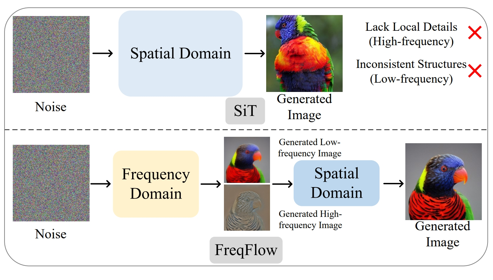

# FreqFlow
The official implementation of "Frequency-Aware Flow Matching for High-Quality Image Generation"

[](https://arxiv.org/pdf/2604.15521)

### 🎉FreqFlow is accepted by CVPR2026!

## Introduction
Flow matching models have emerged as a powerful framework for realistic image generation by learning to reverse a corruption process that progressively adds Gaussian noise. However, because noise is injected in the latent domain, its impact on different frequency components is non-uniform. As a result, during inference, flow matching models tend to generate low-frequency components (global structure) in the early stages, while high-frequency components (fine details) emerge only later in the reverse process. Building on this insight, we propose Frequency-Aware Flow Matching (FreqFlow), a novel approach that explicitly incorporates frequency-aware conditioning into the flow matching framework via time-dependent adaptive weighting. We introduce a two-branch architecture: (1) a frequency branch that separately processes low- and high-frequency components to capture global structure and refine textures and edges, and (2) a spatial branch that synthesizes images in the latent domain, guided by the frequency branch's output. By explicitly integrating frequency information into the generation process, FreqFlow ensures that both large-scale coherence and fine-grained details are effectively modeled low-frequency conditioning reinforces global structure, while high-frequency conditioning enhances texture fidelity and detail sharpness. On the class-conditional ImageNet-256 generation benchmark, our method achieves state-of-the-art performance with an FID of 1.38, surpassing the prior diffusion model DiT and flow matching model SiT by 0.79 and 0.58 FID, respectively.



## Preparation
All models are trained on ImageNet.

## Training
```python

accelerate launch --multi_gpu --num_processes 32 --num_machines 4 --main_process_ip $ip --machine_rank $rank \
        --main_process_port $port --mixed_precision fp16 train_ldm_discrete.py \
        --config=configs/freqflow.py
```


## Inference

```python
accelerate launch --multi_gpu --num_processes 8 --main_process_port $port --mixed_precision fp16 eval.py \
            --config=./configs/freqflow.py \
            --nnet_path=/path/to/nnet_ema.pth \
            --IMGsave_path=/path/to/ \
            --cfg=$cfg --cfg_scale_pow=1.0 --guidance $guidance
```

## Reference
If you have any question, feel free to contact [Sucheng Ren](oliverrensu@gmail.com)

```
@article{ren2025xar,
       title={Frequency-Aware Flow Matching for High-Quality Image Generation}, 
       author={Sucheng, Ren and Qihang, Yu and Ju, He and Xiaohui, Shen and Liang-Chieh, Chen},
       year={2026},
       booktitle = {CVPR}}
```
